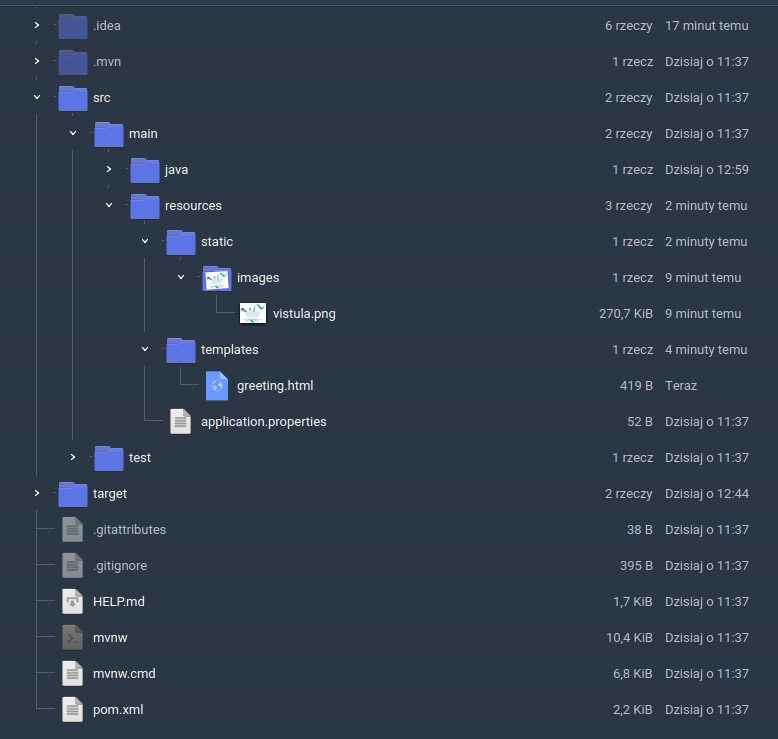

# Introduction to Spring Framework

This repository contains solution of the task 1 from the file named "PIERWSZE APLIKACJE PRZY UŻYCIU
FRAMEWORKA SPRING (BOOT)".

## Steps to run

1. Preparing the project according to the instructions sent by the lecturer. In this case it looks as following:


2. Unpacking a downloaded file.

3. Opening IDEA IntelliJ, chosing new -> project from existing sources and pointing the file in the unpacked folder:


4. IDE should load all required files then. After entering code as written below project may be run. We can also see warning about not finding templates, but it will be changed in next steps:


5. Creating package controller, new class in it - HelloController and entering the code:


6. Running the program, opening network browser and entering: 

```
http://localhost:8080
```

7. The result:


8. Changing HelloController and adding greeting.html:


9. Running the program again, opening network browser and entering: 

```
http://localhost:8080/greeting?name=Vistula
```

10. Enjoying the final result:


#### Worth noting

The folder structure is actually:



However, in the IDE resources folder shows "static.images", which may be misleading. Please keep that in mind. 


## Contributing

Please open an issue first to discuss what you would like to change or / and add.

### Project image source

[Vistula University](https://vistula.edu.pl/promotion/zyczymy-optymizmu-pozytywnej-energii-i-realizacji-planow)
